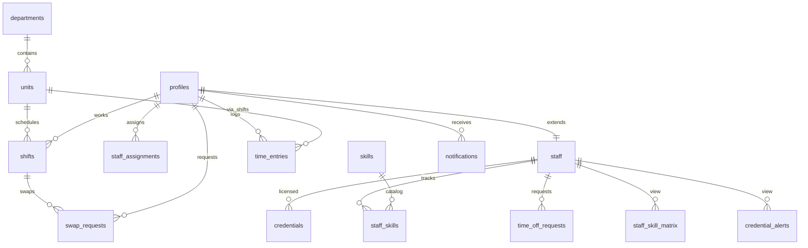

# ER Diagram (Mermaid)

```mermaid
erDiagram
  profiles ||--|| staff : extends
  profiles ||--o{ staff_assignments : assigns
  departments ||--o{ units : contains
  units ||--o{ shifts : schedules
  profiles ||--o{ shifts : works
  shifts ||--o{ swap_requests : swaps
  profiles ||--o{ swap_requests : requests
  profiles ||--o{ time_entries : logs
  staff ||--o{ credentials : licensed
  staff ||--o{ staff_skills : tracks
  skills ||--o{ staff_skills : catalog
  staff ||--o{ time_off_requests : requests
  profiles ||--o{ notifications : receives
  units ||--o{ time_entries : via_shifts
  staff ||--o{ staff_skill_matrix : view
  staff ||--o{ credential_alerts : view
```

Use this as the reference for Supabase schema and RLS policies.
